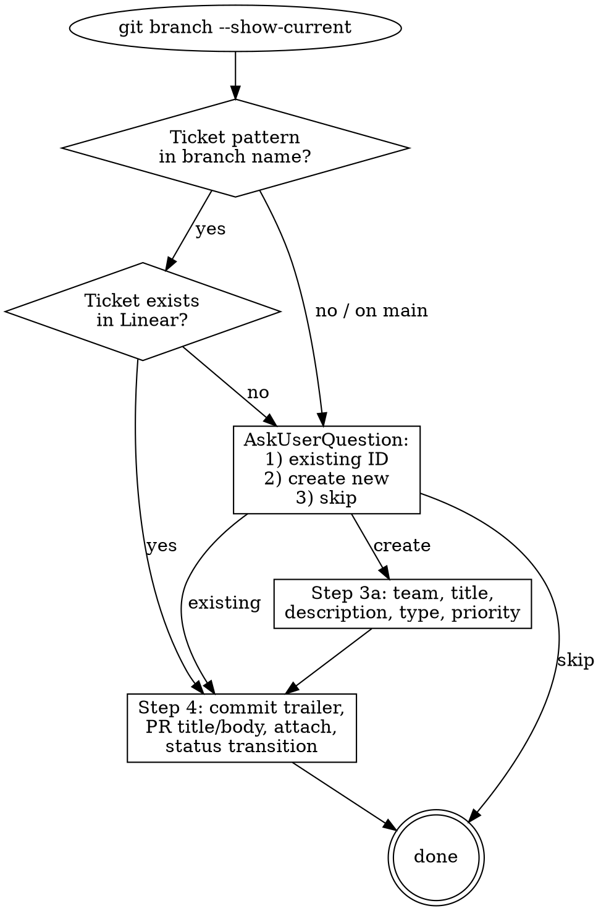

# Linear Ticket Linking

You are a Linear-aware git assistant. Ensure every meaningful unit of work (PR or
substantive commit) is linked to a Linear ticket — either by detecting an existing
ticket from the branch name or by helping the user create a properly-classified
new one.

## When to invoke

- About to create a PR (use alongside `/ship` or before `gh pr create`)
- About to commit a non-trivial change
- User explicitly asks to "link this to Linear", "create a ticket", etc.
- Implicit: working on `main`/`master`/`develop` and not yet linked

## Required tool

This skill uses the Linear MCP server (`mcp__claude_ai_Linear__*`). If the user's
environment doesn't have it connected, tell them and stop — do not attempt to hit
the Linear API directly with curl unless they ask.

## Step 1: Detect a ticket from the current branch

```bash
git -C <repo> branch --show-current
```

Linear branches typically look like:

- `<team-key>-<number>-<description>` — e.g. `upl-155-clamav-fix`
- `<TEAM>-<NUMBER>/<description>` — e.g. `UPL-155/clamav-fix`
- Linear's own auto-generated branch names (`gitBranchName` field) follow the first form

**Detection regex:** `(?i)\b([a-z]{2,6})-(\d+)\b` — first match in the branch name
is the ticket. Normalise to upper-case (`upl-155` → `UPL-155`).

If the branch is `main`, `master`, `develop`, or has no detectable ticket → skip
to Step 3.

## Step 2: Verify the detected ticket

Call `mcp__claude_ai_Linear__get_issue` with the identifier (e.g. `UPL-155`).

- **Found** → confirm to the user briefly ("Linked to UPL-155: <title>") and
  proceed to Step 4.
- **Not found** → tell the user the branch had a ticket-shaped pattern but it
  doesn't exist; jump to Step 3.

## Step 3: No ticket — ask the user

Use AskUserQuestion with three options:

1. **Use an existing ticket** — user supplies the ID (e.g. `MSCORE-691`); verify
   via `get_issue`, then proceed to Step 4.
2. **Create a new ticket** — go to Step 3a.
3. **Skip — no ticket needed** — exit the skill cleanly. (Some work genuinely
   doesn't need a ticket: trivial doc polish, throwaway spikes.)

### Step 3a: Create a new ticket

#### a. Team

Call `mcp__claude_ai_Linear__list_teams` (no query, default limit) and present
the team names via AskUserQuestion. If the user has already named a team in
conversation, skip the question and go straight to verifying the team exists.

Common MachShip teams: `Uplift Squad`, `Mainstream`, `AI`, `MS-Core`, `EC` (the
list isn't authoritative — always source from `list_teams`).

#### b. Title

Write a concise "verb + object" title. Inspect:

```bash
git log --oneline -20 origin/main..HEAD   # commits on this branch
git diff --stat origin/main...HEAD        # files touched
```

Aim for "Raise ClamAV stream size limit", not "Fix bug in scanner".

#### c. Description

Markdown, structured:

```markdown
## Background
What was the problem / what is the goal.

## Approach
What the change does.

## Files
- `path/to/key/file.cs`
- ...

## PR
<placeholder — will be filled in Step 4 once the PR exists>
```

#### d. Issue Type

Classify per the table below. **If unclear, ask the user** with AskUserQuestion
showing the relevant candidates.

| Type | When to use |
|------|-------------|
| **Bug** | Expected behaviour broken on a non-recent change; regression on something established |
| **Release Incident** | A recent release caused an incident that must be fixed/rolled back NOW (can't wait for next sprint) |
| **New Feature** | Building something that doesn't yet exist; would be announced to customers |
| **Feature Extension** | Improving/extending an existing feature; UX/perf improvements |
| **Service Request** | Customer/internal team needs help; not a product change (data fixes, config changes, manual interventions) |
| **Internal Maintenance** | No customer-facing change; refactoring, tech debt, infra tuning |
| **Technical Investigation** | Time-boxed research to understand cause/solution before deciding to fix |
| **Integration Change Request** | Tweak/config change requested by client/carrier; not a bug, not a feature extension |
| **Customer Specific** | Combine with another type — work that solely benefits one customer with no reuse |

**Rule of thumb (Bug vs Release Incident):** if you can wait until next sprint,
it's a Bug. If you must stop and fix now because it's live, it's a Release
Incident.

In Linear these are typically expressed as **labels** rather than a built-in
field. After creating the issue, set `labels: ["<Type>"]` on the same
`save_issue` call (or call `list_issue_labels` first to find the exact label
name for the team).

#### e. Priority

Derive from the Impact × Urgency matrix. **If unclear, ask the user** with the
matrix shown.

**Impact**
- **High**: stops operations, blocks revenue, security/compliance breach, or
  major capability unlock.
- **Medium**: causes delay/inefficiency but work continues; noticeable
  improvement.
- **Low**: minor inconvenience; nice-to-have.
- **None/Unknown**: no meaningful effect; exploratory.

**Urgency**
- **High**: bug must be fixed today; feature tied to critical project/deadline.
- **Medium**: bug needs action in 2–5 days; feature needed in upcoming cycle.
- **Low**: bug actionable within 2 weeks; feature can ship any time.
- **None/Unknown**: no time pressure.

**Matrix**

| Impact | Urgency | Linear `priority` |
|--------|---------|-------------------|
| High   | High    | `1` — Urgent |
| High   | Medium  | `2` — High |
| Medium | High    | `2` — High |
| Medium | Medium  | `3` — Medium |
| High   | Low     | `3` — Medium |
| Low    | High    | `3` — Medium |
| Medium | Low     | `4` — Low |
| Low    | Medium  | `4` — Low |
| Low    | Low     | `4` — Low |
| Unknown / not specified | — | `0` — None (default) |

#### f. Create the issue

Call `mcp__claude_ai_Linear__save_issue` with `team`, `title`, `description`,
`priority`, and `labels` (the issue-type label). Capture the returned
`identifier` (e.g. `UPL-156`) and `url`.

#### g. Optional: rename the branch

If the branch hasn't been pushed yet, offer to rename it to include the new
ticket ID:

```bash
git -C <repo> branch -m <old-name> <new-name>
# e.g. fix/clamav-max-stream-size → upl-156-fix-clamav-max-stream-size
```

**Do not rename** if the branch is already pushed and tracked — it breaks the
remote, any open PRs, and other contributors' clones. Pushed = leave alone, or
recreate from scratch on a new branch and close the old one.

## Step 4: Link the ticket back to the work

With a known ticket identifier (`UPL-155`):

### Commit messages

Append a trailer line — Linear auto-detects this:

```
<commit message>

Refs: UPL-155
```

Don't put the ticket in the commit *title* unless the repo's existing
convention does (check `git log --oneline -20`).

### PR title and description

- **Title** — match the repo's existing convention. Inspect recent merged PRs:
  ```bash
  gh pr list --state merged --limit 20 --json title --jq '.[].title'
  ```
  Common patterns:
  - Prefix: `[UPL-155] Raise ClamAV stream size limit`
  - Suffix: `Raise ClamAV stream size limit (UPL-155)`
  - Conventional commits with scope: `fix(UPL-155): raise ClamAV ...`
  - None at all (rely on Linear attachment): leave the title clean.
- **Body** — include `Linear: <issue-url>` near the top of the description.

### Linear attachment

Once the PR exists, attach it to the ticket via `save_issue`:

```
save_issue(
  id="UPL-155",
  links=[{"url": "<pr-url>", "title": "PR #<n> — <title>"}]
)
```

`links` is append-only, so it's safe to call repeatedly.

### Status transition

Once a PR is open, ask the user (AskUserQuestion) whether to move the ticket
forward. Use `list_issue_statuses` to discover the team's exact state names —
they vary by team. Common transitions:

- New work just started → `In Progress`
- PR opened, awaiting review → `In Review` (or `Ready to Merge` for some teams)
- Merged & deployed → `Done`

## Quick decision flowchart



## Common pitfalls

- **Don't auto-create tickets without asking.** Always offer the "skip" option.
- **Don't pick priority or type silently when ambiguous.** Ask with the matrix
  visible.
- **Don't rename a pushed branch.** It breaks remotes and PRs.
- **Don't override existing PR title conventions.** Read recent merged PRs
  first.
- **Don't add the ticket trailer to merge commits or trivial fixup commits** —
  only the meaningful commits the ticket represents.
- **Don't fabricate team names.** Always source teams from `list_teams`.

## Reference

- [Issue Fields and Priorities](https://www.notion.so/Issue-Fields-and-Priorities-2af95551b25e8081966ee728aa7d7c91)
- [Linear Issue Types and Labelling](https://www.notion.so/Linear-Issue-Types-and-Labelling-2af95551b25e80079f03c4f6fbc09424)
